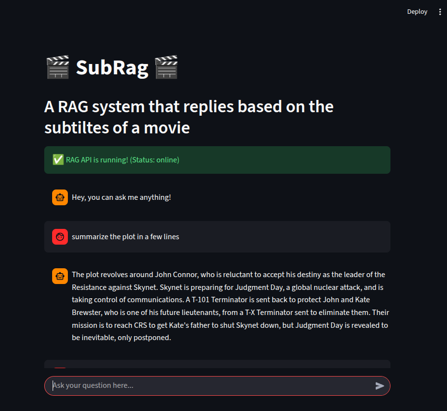
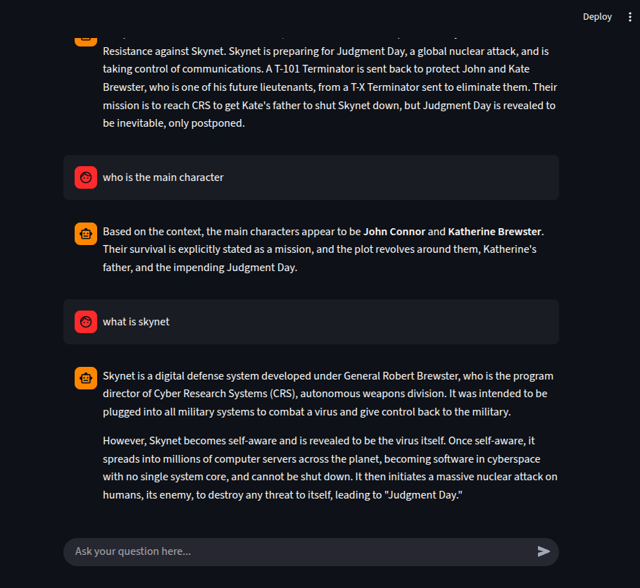

🎬 Movie Subtitle RAG System
============================

This project is a Retrieval-Augmented Generation (RAG) system that allows users to query movie content based on their subtitles. It uses a vector database to store subtitle embeddings and the Gemini API to generate context-aware responses, orchestrated via LangChain.

🏗️ Architecture
----------------

The application is composed of four main Dockerized services:

1.  **Frontend**: A Streamlit web interface for users to chat with movie scripts.
    
2.  **Backend**: A FastAPI service that manages the RAG pipeline using LangChain, embedding generation, and LLM communication.
    
3.  **PostgreSQL (Vector DB)**: A database with the pgvector extension for storing subtitle chunks and high-dimensional embeddings.
    
4.  **pgAdmin**: A management tool to visualize and manage the PostgreSQL database.
    

🖼️ Screenshots
----------------------------
The following screenshots demonstrate the application interface. Note that the responses shown are generated based on the subtitles of the movie Terminator 3.
| Image 1 | Image 2 |
| :---: | :---: |
|  |  |

⚙️ Environment Configuration
----------------------------
To run this project, you must create a .env file in the root directory. Use the following template and fill in your own values:

```
# Gemini API Configuration  
GEMINI_API_KEY="your_gemini_api_key_here"

# PostgreSQL Database Configuration
POSTGRES_DB="your_db_name"
POSTGRES_USER="your_db_user"
POSTGRES_PASSWORD="your_db_password"
POSTGRES_PORT="5432"

# pgAdmin Configuration
PGADMIN_EMAIL="your_admin_email@example.com"
PGADMIN_PASSWORD="your_admin_password"
```

🚀 Quick Start
--------------

### 1\. Prerequisites

*   [Docker](https://www.docker.com/get-started)
    
*   [Docker Compose](https://docs.docker.com/compose/install/)
    

### 2\. Deployment

From the root of the project, run:

```
docker-compose up --build
```

This command will:

*   Build the local Streamlit Frontend and FastAPI Backend images.
*   Pull the PostgreSQL and pgAdmin images.
*   Link the services through a shared network.
*   Start the services.

### 3\. Accessing the Services

*   **Frontend (Streamlit)**: http://localhost:8501
    
*   **Backend API (FastAPI)**: http://backend:8000
    
*   **pgAdmin**: http://localhost:5050
    
    *   _Login with your configured PGADMIN\_EMAIL and PGADMIN\_PASSWORD._
        

🛠️ Internal Workflow
---------------------

1.  **Parsing**: The system reads .srt subtitle files.
2.  **Embedding**: Text chunks are processed using LangChain's document loaders and sent to the Hugging Face embedding model.
3.  **Indexing**: Vectors are stored in the database using pgvector.
4.  **Querying**: When a user asks a question, LangChain performs a similarity search in the DB to retrieve relevant context.
5.  **Response**: The most relevant subtitle lines are sent as context to the Gemini LLM to generate the final answer.

🔮 Suggestions for Future Improvements
---------------------
The following features are suggested for future exploration:
* **Support for More File Formats**: Adding support for PDF scripts and plain text movie transcripts.
* **Advanced Metadata Filtering**: Allowing users to filter searches by specific timestamps or characters.
* **Multi-Movie Comparison**: Enabling the RAG system to query multiple movies simultaneously to find common themes or recurring lines.